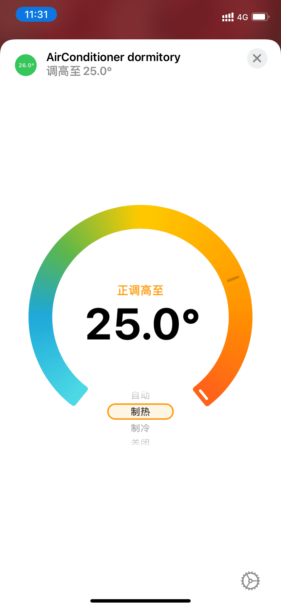
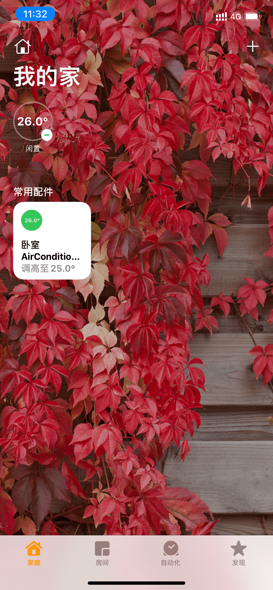

# ESP32 HomeKit AirConditioner项目笔记

我是小白，肯定有一些欠妥的地方，欢迎批评指正！

## 硬件部分

[原理图和PCB文件](/docs/AD_files)可以在/docs/原理图PCB中找到。

### 锂电池充电放电

##### 锂电池充电MCP73833

首先USB5V进来，通过MCP73833锂电池充电芯片给锂电池充电，这个芯片是参考[peng-zhihui的Gluon-Power](https://github.com/peng-zhihui/Project-Quantum/tree/master/1.Hardware/Gluon-Power)才用的，因为之前没没有设计过锂电池相关的电路。

可以驱动三个LED显示当前充电状态，R6那个1KΩ的电阻确定充电电流为1A，达到4.2V LED会显示充满并停止充电。

##### USB 锂电池供电选择

这个电路是群里大佬分享的，因为担心在插着USB充电的情况下，锂电池边充电边放电会有问题，所以才有这个电路。功能就是在有USB5V接入的时候，DCDC芯片的输入是USB5V提供的，而断开锂电池的输入；在没有USB5V接入时，DCDC芯片的输入是锂电池提供。这样就可以做到充电的时候只是单纯的给锂电池充电，同时5V输入负责给ESP32供电。[原理传送门](https://mp.weixin.qq.com/s/PFX6RQysr8UhUfQNe2Paqg)。

##### 锂电池保护电路DW07

网上随便找的一个芯片DW07，按照数据手册的电路图链接的。具体细节没有研究。

##### DCDC芯片TPS6300

在TI官网找的一个满足功能，价钱合适的一款buck-boost芯片TPS6300。自动切换升压降压模式，这一款是可以根据分压电阻改变输出电压的，主要还是可变电压的这一款便宜点。最大电流可以达到1A（如果我没理解错的话），因为用了7个红外二极管，每个大概50mA，一共就350mA了，再加个ESP32的电流，所以找的这个能输出1A的芯片。

### ESP32模块

这个没什么好说的，我怕天线那部分搞不好，所以直接买的模组。只把下载口，使能，启动模式接口引了出来。但是在送出去打样之后我发现个问题，我在设计PCB的时候，当时还纳闷为什么模组天线下面低层敷铜的话敷不上去，模组不是在顶层吗？后来想到应该是防止电磁屏蔽之类的，但是我PCB除了天线之外的部分底层都敷铜了，这样应该会影响到信号吧。

### 红外二极管驱动

这里选择用N沟道的MOSFET来驱动，为什么不用P沟道，我是这样想的：因为ESP32的rmt模块输出的信号是38kHz调制后的，比如要发送引导码（高4.4ms再低4.4ms），相当于要让红外二极管前4.4ms是有38kHz的脉冲，后面4.4ms是没有导通的，也就是MOSFET前4.4ms以38kHz以占空比33％导通，后面4.4ms关闭，用N沟道的话很好理解，4.4ms的高电平加上4.4ms的低电平经过调制接到MOSFET的G极就好了，但是如果用P沟道，P沟道的G极的电平是要前4.4ms以占空比66％为高电平（其中的33％的低电平P-MOS是导通的），后4.4ms为高电平，调制前的引导码怎么设计才能输出这样的波形呢？我能想到的是，IO口一直输出高电平，但是前4.4ms调制，后4.4ms不调制，这样没有N沟道用着简单。

## 软件部分

就按照程序的启动顺序来写。

### HomeKit

##### 核心概念

首先要知道，在HomeKit中，定义了一个配件accessory，一个配件可以有多个服务service，每个服务又可以有多个特征characteristic。比如一个有照明功能的风扇，这是一个配件，但是他又三个服务：必备的的信息服务the Required Accessory Information service、风扇服务a Fan service、电灯服务a Light Bulb service；在风扇服务中，又有多个特征，必备的特征：状态Active，可选则特征：名称Name，转向Rotation Direction，转速 Rotation Speed等等。这些以及被定义的服务和特征都可以在[HAP-Specification-Non-Commercial-Version.pdf](/docs/pdf/HAP-Specification-Non-Commercial-Version.pdf)找到。特征又包括读写权限，这个就是造成某些信息在改变后不能即使更新，而是必须把App切到后台再切回来才能更新的原因。

在这个项目中，只有一个空调服务，查看代码可以直到，这个所谓的空调，实际上是用的HomeKit中定义的恒温器来实现的。恒温器和空调确实不是一个东西，当时我也看了一些以及做好的空调伴侣中家庭App的显示，也都是以恒温器的界面来显示的。为什么HomeKit不专门定义一个空调服务呢？就是因为是恒温器，才造成了一堆问题。

恒温器目前定义的特征有：
- Active（开关状态）- 读写
- Current Temperature（当前环境温度）- 只读
- Current Heater Cooler State（当前运行模式）- 只读
- Target Heater Cooler State（设定的模式）- 读写
- Name（名称）- 只读
- Rotation Speed（转速）- 读写
- Cooling Threshold Temperature（开始制冷门限）- 读写
- Heating Threshold Temperature（开始制热门限）- 读写

> 这里的读写，是以家庭App为主语来说的，是家庭App的读写权限。但是在ESP32上，这些值不论读写，都是可以被改变的。

在家庭App的配件的详情页中，三种模式（自动、制热、制冷）对应的是Target Heater Cooler State，制冷制热模式对应的温度是Cooling Threshold Temperature或者Heating Threshold Temperature，转速对应Rotation Speed，开关对应Active。

##### 温度范围问题：

发现没有，这些特征都是可写的。同时这也是为什么在制热模式下，最高温度只能开到25℃的原因，因为这个25℃是在Heating Threshold Temperature特征中被HoneKit限制死的，实际上设定的是制热门限，就是说，温度到了XX度以下开始制热的温度，所以HomeKit最高才给了25℃，同样的Cooling Threshold Temperature最高能到35℃，意思是说超过35℃之后开始制冷的温度。什么叫TM的惊喜！这就叫TM的惊喜！

##### 只读特征刷新问题：

而在刚刚打开家庭App的界面上，“我的家”三个字下面的圆环里的温度对应着Current Temperature，圆环下面的“关闭”的位置对应着Current Heater Cooler State，因为关闭的时候没有模式一说，所以显示的是关闭，这个问题不大。主要是：在详情页中改变了温度和模式之后，再回到刚开始的页面（前提是不切到后台再进来），会发现圆环里的温度还是原来的温度26℃，模式显示的是“闲置”，这个26和闲置，是刚刚创建恒温器服务时赋的初值。所以说刚刚修改的模式和温度并没有在这里体现，因为他们根本不是一个特征啊！**这些特征是只读的，目前只发现在打开或者从后台切出家庭App时这些特征会被重新读取，没有找到主动读取的方法。**

### ESP HomeKit SDK

##### Register Service Write/Read callback

程序在创建完上面配件必要的一些服务和特征时候，就会添加写回调函数`hap_serv_set_write_cb(service, air_conditioner_write)`和读回调函数`hap_serv_set_read_cb(service, air_conditioner_read)`了。我目前的理解只是知道在家庭App中写入特征的值时会调用`air_conditioner_write`在读取时会调用`air_conditioner_read`同时这两个函数的返回值，如果返回失败，那么家庭App中就会显示配件“未响应”

- `air_conditioner_write`：它一次处理的是多个特征的值，比如从关机状态切换到制冷状态，会发送Target Heater Cooler State和Active这两个特征的值（因为温度默认初始26℃，所以没有发送）所以函数的参数是一个`hap_write_data_t`的数组，for循环每次只对其中一个特征进行匹配和处理，记录下设定的值用来发送红外指令和`air_conditioner_read`中的更新。然后把这些新的值通过`hap_char_update_val`写入到HAP Core中完成更新。

	> 这里一开始有一个小bug，就是在改变模式的时候，不知道为什么，家庭App会向配件发送两次相同的数据，就是会调用`air_conditioner_write`两次（如果你用Siri会发送三次，第一次是原来的模式，后面两次是修改后的模式），在监视器输出中也能看到打印的信息有两次是重复的。不过不处理的话，ESP32会连续向空调发送重复的红外指令，所以后面添加了一个1.5S的等待新指令的程序来解决这个。
	> 
	> 还有一个值得注意的是：我猜测，HAP Core中有这些特征真正的值，`air_conditioner_write`参数中的都只是拷贝罢了，因为最后是要调用`hap_char_update_val`才是真正的写入。

- `air_conditioner_read`：这个不同于`air_conditioner_write`会一次输入多个特征的值，而是一个特征对应一次调用。为了改变上面的只读特征刷新的问题，在上面的`air_conditioner_write`处理对应特征的时候记录了设定的温度和模式，这样最起码能在下次打开App时刷新，而不是圆圈里一直显示着26℃和“闲置”，比如，在改变制冷模式下的温度时，设定的实际上是Cooling Threshold Temperature，处理这个特征的时候保存了当前设定的温度，再后面重新切回到家庭App时，`air_conditioner_read`会被调用，此时就根据之前记录的设定的温度和设定的模式更新Current Temperature为设定的温度，Current Heater Cooler State为设定的模式，以及Cooling Threshold Temperature和Heating Threshold Temperature为去掉小数后的值。然后调用`hap_char_update_val`写入到HAP Core中完成更新。其他可以读取的特征在这个函数里都要进行处理，目的是要返回`HAP_SUCCESS`不让配件显示为未响应的情况。

	> `hap_char_update_val`是把特征的值写入到HAP Core中，所以说**每次打开家庭App中读取的状态或者值是从HAP Core中读取的**。
	> 
	> 一开始是没有`hap_serv_set_read_cb(service, air_conditioner_read)`这行代码登记回调函数的，这种情况下只会去读取`air_conditioner_write`中被更新的值。

**所以说目前最大的问题就没有找到让家庭App主动去读HAP Core中特征的值的办法，这样就不需要折腾了。**

### RMT (Remote Control) module driver

##### 基本介绍

这个是ESP-IDF自带的一个发送和接收红外遥控信号的库，可以设定载波的频率和占空比，然后自动帮你把要发送的码元进行调制。这个项目代码是基于NEC例程的代码改过来的。有两个名词需要知道，具体的[官方文档](https://docs.espressif.com/projects/esp-idf/zh_CN/latest/esp32/api-reference/peripherals/rmt.html)有详细介绍。
- items：一个长度为32bit的结构体，bit0-bit14是电平1持续的周期（单位ticks），bit15是这个电平1的高低；bit16-bit30是电平2持续的周期，bit31是电平2的高低。对应的结构体类型是`rmt_item32_t`，如果items中的周期为0，则会停止发送。
- ticks：是时钟分频后的方波周期，项目里是80M的80分频，也就是1us。

在发送摩斯电码的例程中，启动发射的函数`rmt_write_items(ac_tx_channel, items, length, true)`就是按照rmt_item32_t数组中的信息来发送的。

要搞清楚三个结构体类型（源码也贴在下面了）：

- `ir_builder_config_t` ：ir_builder的配置

		typedef struct {
			uint32_t buffer_size; /*!< Size of the internal buffer used by IR builder */
			ir_dev_t dev_hdl;     /*!< IR device handle */
			uint32_t flags;       /*!< Flags for IR builder, different flags will enable different features */
		} ir_builder_config_t;

- `nec_builder_t` ：NEC编码的一些引导码等码的高低电平时间，自己添加了分割码，以及rmt_item32_t数据存放的空间的首地址

		typedef struct {
		    ir_builder_t parent;
		    uint32_t buffer_size;
		    uint32_t cursor;	// 记录当前读取到的items的下标
		    uint32_t flags;
		    uint32_t leading_code_high_ticks;
		    uint32_t leading_code_low_ticks;
		    uint32_t repeat_code_high_ticks;
		    uint32_t repeat_code_low_ticks;
		    uint32_t payload_logic0_high_ticks;
		    uint32_t payload_logic0_low_ticks;
		    uint32_t payload_logic1_high_ticks;
		    uint32_t payload_logic1_low_ticks;
		    uint32_t ending_code_high_ticks;
		    uint32_t ending_code_low_ticks;
		    uint32_t divide_code_high_ticks;    // 添加分割码
		    uint32_t divide_code_low_ticks;
		    bool inverse;
		    rmt_item32_t buffer[0];
		} nec_builder_t;

- `ir_builder_t` ：在`nec_builder_t`中使用的一个变量类型，主要是存放一些回调函数的地址，也添加了分割码

		struct ir_builder_s {
		    uint32_t repeat_period_ms;
		    esp_err_t (*make_head)(ir_builder_t *builder);
		    esp_err_t (*make_logic0)(ir_builder_t *builder);
		    esp_err_t (*make_logic1)(ir_builder_t *builder);
		    esp_err_t (*make_end)(ir_builder_t *builder);
		    esp_err_t (*build_frame)(ir_builder_t *builder, const AC_R05D_PAYLOAD_CODE send_code);
		    esp_err_t (*build_repeat_frame)(ir_builder_t *builder);
		    esp_err_t (*build_divide_frame)(ir_builder_t *builder);
		    esp_err_t (*get_result)(ir_builder_t *builder, void *result, uint32_t *length);
		    esp_err_t (*del)(ir_builder_t *builder);
		};

##### 大致流程

###### 配置

先根据基本的配置信息进行配置，`ir_builder_config_t`类型的变量`ir_builder_config`设置的保存items的空间大小为128个items（`nec_builder_t`中的`buffer`就是指向的这额外128*32bits的空间的首地址）。然后调用`ir_builder_rmt_new_nec`返回给一个`ir_builder_t`类型的`ir_builder`变量，这个函数的作用就是开辟了`ir_builder_t`类型大小+额外128个`rmt_item32_t`大小的空间，把首地址给一个`nec_builder_t`类型的`nec_builder`变量，然后根据一些R05D编码时长的宏定义赋值到`nec_builder`变量的成员中保存，以及构造逻辑0逻辑1和引导码，分割码的这些函数指针赋值给`nec_builder`的成员`parnet`的函数指针成员。最后返回`&nec_builder->parent`赋给`ir_builder`。

> 这个时候返回的`ir_builder`变量的成员里主要是一些函数指针，具体的码的时间长度是在他的“父结构体”中的，这也是为什么像`nec_builder_make_head`这些函数中使用了`__containerof(builder, nec_builder_t, parent)`来获取“父结构体”的地址。（这只是我的简单理解）

###### 建立帧结构

基本的准备完成了之后，再根据之前再HomeKit的写回调函数中保存的一些模式温度的信息，就到了发送红外指令的阶段了，先调用之前`ir_builder_rmt_new_nec`返回的`ir_builder`变量传进来的函数地址指向的函数体`nec_build_frame`，顾名思义，就是根据之前的信息建立NEC码（实际上是R05D码）的items，往之前开辟的128个items里放入合适的周期数和电平等级。

先用`__containerof(builder, nec_builder_t, parent)`获得他的“父结构体”的首地址给`nec_builder`变量，因为这个`nec_builder`中存放着一些要发送的码的时长等信息，同时把cursor清零，表示我们从第一个itmes开始填数据。先建立要发送的引导码，就是4.4ms的高电平，再4.4ms的低电平。就是往第一个itmes空间放入电平1的周期为4400个ticks（每个ticks是1us，一共就是4.4ms），电平1的高低为高电平，因为`nec_builder->inverse`的值为`false`，电平2的周期为4400个ticks，电平2的高低为低电平，然后`cursor += 1`这样引导码就建立好了。

> 只能说根据实际来看，很多文档中说的引导码应该是先低电平再高电平，但是**发的时候确是按相反的来发**的，后面的逻辑0逻辑1，分割码，结束码也是一样。就是说发引导码的时候红外二极管要先以4.4ms f = 38kHz D=33％导通，再4.4ms关闭，这里说的和硬件没关系，用P沟道红外二极管也是这样。

后面就是根据R05D的**AA' BB' CC' S AA' BB' CC'** 这样的格式建立起来的，[R05d电控功能说明书](/docs/word/R05d电控功能说明书.doc)，A一般都是固定的0xB2即0b1011 0010，就for循环8次，每次判断是填逻辑0的编码还是填逻辑1的编码，**但是这里是从最高位开始发的要注意！**

咱一开始是不知道要发结束码的，后来怎么搞空调都没反应，走头无路了，就试着加上一个结束码0.54ms的高电平再30ms的低电平，低电平应该够长就行，加上后空调终于有响应了，添加结束码的时候，要把下一个items的周期填0，这样才能停止发送。然后`ir_builder->get_result`这个函数就是把刚刚那块itmes的首地址赋值给传入的指针和长度（长度也就是`cursor`最后的值），这里面的强制类型转换放在等号左边我想了很久。。。之后就是把刚刚填入的那些items的信息通过`rmt_write_items`发送出去就行了。

###### 发送

构造帧，发送帧这些都放在了一个`ac_send_r05d_code(AC_INFO ac_info)`函数中了，根据要发送的空调的信息把AA' BB' CC' S AA' BB' CC'这些赋值不同的代码，再构造帧后发送。原本这个`ac_send_r05d_code`函数在HomeKit的写回调函数的最后会被调用，但因为短时间内发送多条红外指令的问题，改成了把允许发送的`ac_send_r05d_code_flag`变量置为`true`，并且记录HomeKit写回调函数被调用时的tick计数给`ac_send_tick_count`变量，用来给后面的另一个线程判断1.5S内没有新的指令。

###### 发送等待

上面提到的在改变模式时，以及改变风速时，会造成短时间内发送多条红外指令，为了避免这样的问题，新开辟了一个线程，而且FreeRTOS以前没有接触过，就按照其他的一些例程照葫芦画瓢了。

这个线程就是每隔0.1S检查`ac_send_r05d_code_flag`是否为`true`，当为`true`后，检查`ac_send_r05d_code`和`nowTickCount`的差值，如果他们之间的差值大于1.5S的tick个数，那么就根据当前保存的模式发送红外指令，同时把`ac_send_r05d_code_flag`置为`false`否则我们就不发送红外指令。这样如果1.5S内有新的指令到来，`ac_send_r05d_code_flag`就会被更新，那么之前的指令有可能就会被覆盖而没有发送出去，直到1.5S没有新的指令到来，才根据当前的信息发送指令。

这样就发完了一个基本功能的红外指令，其他的重复码，以及空调的高级功能，emmmmmm随缘吧(～￣▽￣)～

