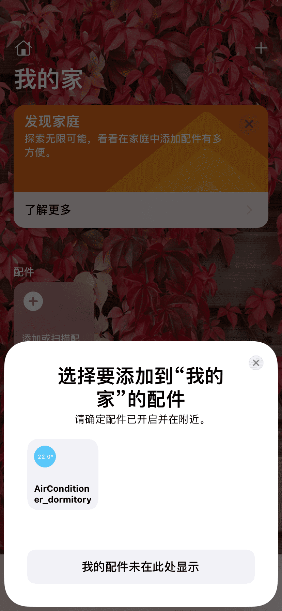
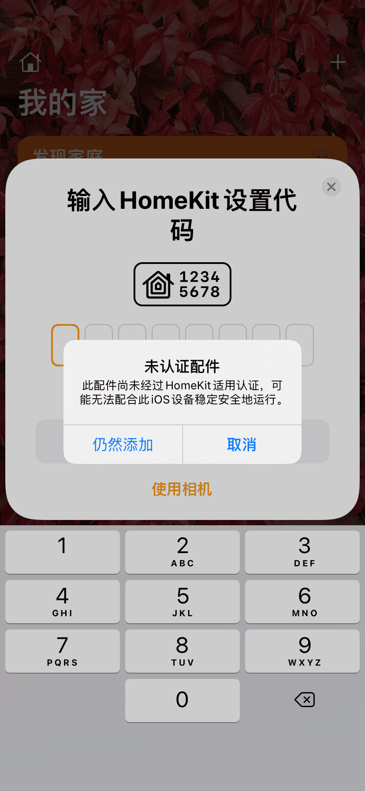
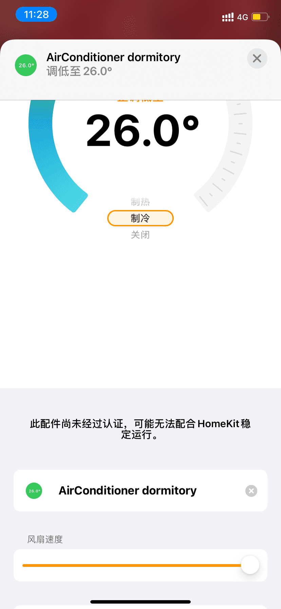

# 接入HomeKit的ESP32空调控制器
## 介绍

- 因为宿舍空调遥控器有问题，而且最近没啥事情做，所以想到使用ESP32做一个空调伴侣，接入Apple的HomeKit实现iOS设备对空调的控制，目前只能对美的空调进行控制，只包括基本功能：**开关**、**模式**(自动、制冷、制热)、**温度**(制冷17-30℃，制热17-25℃)、**风速**(自动风、低、中、高风)。锂电池供电，可用MicroUSB接口充电，充满自动断开，基本的锂电池保护（硬件是设计了但我也没实际测试过O(∩_∩)O），锂电池保护，DW07D这里要注意一点，就是如果第一次装上电池，需要先充电一下才能正常供电，只要不把电池拆下来，就不必再这样做。

- 目前问题或bug(具体原因[笔记](/Note.md)中会解释)：
	- 家庭App界面，在设定空调一些参数后（比如模式），长按配件后出现的设定界面会更新状态，但是打开家庭的初始界面中不能立刻更新，必须把家庭App切到后台再切回来才能更新。
	- 家庭App中空调制热的设定范围，注意是显示的设定范围，是到0\~25℃，制冷温度的设定范围是10\~35℃，实际上如果超出了17\~30℃这个范围的话就还是17℃或者30℃。

- 这个项目参考了乐鑫的homekitSDK和ESP-IDF中的红外NEC编码示例。以及美的的R05D编码的文档。相关链接放在下面：

>  [ESP HomeKit SDK](https://github.com/espressif/esp-homekit-sdk) 其中的/examples/emulator例程相当于是一个仿真，在这个例程里可以创建很多的homekit支持的配件，但是没有实际的效果，参考了里面air conditioner的一段程序。这个SDK都是没有MFI认证的Non-Commercial-Version，所以配对时都会提示此配件不可信任，具体关于homekit协议的参考[HAP-Specification-Non-Commercial-Version](/docs/pdf/HAP-Specification-Non-Commercial-Version.pdf)这个文档。
>  
> [ESP-IDF NEC](https://github.com/espressif/esp-idf/tree/master/examples/peripherals/rmt/ir_protocols) 乐鑫官方的SDK ESP-IDF中的关于NEC编码的例程。
> 
> [R05D介绍](https://www.codenong.com/cs109263771/) 介绍了关于美的空调的红外编码R05D格式，以及一些红外遥控的代码，其中最重要的就是高位先发，低位后发，而且发的是和定义的码电平相反的，这个其他很多文档我都没看到说。以及[ir_Coolix.h](https://github.com/crankyoldgit/IRremoteESP8266/blob/master/src/ir_Coolix.h) 这个红外库的头文件中也可以部分参考(我能发现的就是模式那里这个ir_Coolix.h中多了一位)。

- 这个项目，我很多东西也都是才接触，所以难免有不准确不合适或者错误的地方，看到的兄弟麻烦指出来。

## 硬件连接

只用了一个GPIO18，你可以选择IO直接驱动红外二极管，最好加个NPN三极管或者N沟道的MOSFET驱动。一开始测试的时候我是IO18接到红外二极管正极，通过一个220欧的电阻再到GND，我担心把IO搞坏掉，所以电阻阻值比较大，在220欧的情况下，红外发射距离大致只有5m。所以后面打样的PCB中设计的电路如下：

[具体的AD文件](/docs/原理图PCB)

> 如果图片不显示，请科学上网。或者到/docs/images/目录下查看。

## 环境搭建

- ESP-IDF
- ESP HomeKit SDK

### ESP-IDF
 
要搞好关于ESP-IDF的安装，需要一个比较好的网络，我安装失败了很多次，几乎都是网络问题。具体请参考[官方教程](https://docs.espressif.com/projects/esp-idf/zh_CN/latest/esp32/get-started/index.html)。我只是补充一下，如果用windows的[ESP-IDF 工具安装器](https://dl.espressif.com/dl/esp-idf/?idf=4.4)嫌麻烦建议直接下载离线版本，虽然大，但是解千愁，不会出现什么失败的问题。如果是想用[VS Code的IDE插件](https://github.com/espressif/vscode-esp-idf-extension)的话，也最好找个网好的地方安装，如果本地没有esp-idf，那么要是esp-idf下载失败就会从头开始下载，即使使用本地的esp-idf文件，但是还是需要下载其他东西的，而且这些东西，也挺容易下载失败的，我自己下的时候就算科学上网也是失败了很多次。我下载的时候是4.2版本的，后面更新到4.3也是可以的（4.3好像会弹一些警告），下面以VS Code的IDE插件为例。

### ESP HomeKit SDK

具体也请参考[官方教程](https://github.com/espressif/esp-homekit-sdk)，前提是先安装好ESP-IDF。

## 项目编译、烧录

### 编译准备

1、先把这个项目文件夹放到/esp-homekit-sdk/examples目录下面.
> 因为默认[CMakeList.txt](/CMakeLists.txt)的文件是读取上上级目录中的HomeKitSDK的路径，如下面所示。或者修改根目录下的CMakeLists.txt文件里面添加HomeKitSDK的组件也可以，[CMakeLists文件说明传送门](https://docs.espressif.com/projects/esp-idf/zh_CN/latest/esp32/api-guides/build-system.html#cmakelists)。

	if(DEFINED ENV{HOMEKIT_PATH})
	  set(HOMEKIT_PATH $ENV{HOMEKIT_PATH})
	else()
	  set(HOMEKIT_PATH ${CMAKE_CURRENT_LIST_DIR}/../..)
	endif(DEFINED ENV{HOMEKIT_PATH})

2、使用VS Code打开这个项目文件夹，先clean一下项目，按F1输入ESP Full Clean Project（如果有build文件夹就是把build文件夹删除）要不然里面的某些文件路径可能会导致编译会报错，除非项目路径和我编译时候的一模一样。

3、F1打开输入ESP Device configuration 选择自己使用的设备。

4、选择端口，同样的F1后输入ESP Select port to use选择使用的端口，要先插上板子才会显示。

5、提前设置好wifi的名称和密码，点击左下角的插件中的齿轮图标，然后点击App Wi-Fi，选择使用	Use Hardcoded，填入wifi名称和密码，保存。

> 这个如果使用的是ESP-IDF的CMD或者PowerShell的话（就是安装完ESP-IDF，开始菜单里面多的那俩），再进入到项目根目录下敲入`idf.py menuconfig`这个命令，也会出现相同的设置。
> 这个设置完后，我的理解是把设置的信息都保存到了一个[sdkconfig](/sdkconfig)文件里面，**如果上面的wifi名称有中文，那么这个文件里面的`CONFIG_APP_WIFI_SSID`的值实际上是乱码的，需要在sdkconfig文件中找到`CONFIG_APP_WIFI_SSID`这个定义然后改正确**
> 
> 或者在App WiFi中也可以不选择Use HardCode而选择Use Provisioning，这样不需要先准备好wifi名称和密码，而是在烧录完程序后，他会弹出个二维码，需要下载**ESP BLE Prov**这个App去扫描，用蓝牙连接后再设置wifi。

这里还可以改变到时候在家庭App中配对的代码，默认是11122333，也可以在sdkconfig文件中修改。

> 如果上面的过程中遇到什么问题了，先别忘了clean project，然后可以试一试ESP-IDF PowerShell来搞上面的这些，我在使用的时候，有时候就是VS Code插件里面的会报错，但是ESP-IDF PowerShell里就不会。

### 编译、下载、监视 一条龙服务

上面没问题的话，就可以点击左下角的火焰按钮了，或者依次点击左边三个也是一样的。

> 下载的时候，先把GPIO0拉低（按住GPIO0的按钮SW1不放），然后让EN引脚拉低一下（按下EN的按钮SW2松开），看见控制台有提示连接上后就可以松开GPIO0的按钮SW1了。

在监视的输出界面中，他会弹出个二维码，在iOS设备和ESP32在同一个wifi的情况下，使用家庭App扫描这个二维码就可以配对了，这样就不需要输出那个配对码11122333了

如果二维码扫描不了，但是又想扫的话，可以点击二维码下面的链接。

或者也可以选择“我没有或无法扫描代码”，手动输入配对码添加配件。

一般没有问题的话，他会直接找到这个配件，就像下面这样，点击后输入11122333就可以配对了。

没有MFI认证就会有这个弹窗，点击仍然添加就是啦

配对完成后，监视控制台应该也可看到相应的输出，按“Ctrl+]”可以退出监视器。

## 使用

在家庭App刚刚添加的这个空调配件中，自动模式、制冷模式、制热模式、关闭和设置温度都可以使用，只要不是关闭其他模式都会打开空调。

温度虽然可以设定为小数xx.5℃，但是实际上设定的温度会去掉小数部分。关于设定范围，这个问题在开头提了。

下面的风扇速度对应着空调的风速，因为是一个滑块，滑倒最左边相当于关闭空调，0~33％低风，33~66％中风，66~99％高风，100％也就是最右边为自动风。

> 因为这个滑块在滑动的时候会不断的发送新的值给配件，所以在配件程序里设置了一个延时发送的程序，如果在接收到新的指令后的1.5S内，没有新的指令到来了，才发送红外指令，如果有新的指令，那么上一个指令会被覆盖，再等待1.5S，直到没有新的指令到来后才发送。
> 
> 所以存在1.5S+的延时，有种反应速度慢的感觉。

有一个值得提醒的是：你在长按配件打开详情界面时，这时会发送一次红外指令出去，也就是你当时设置的状态。

至于延时关机开机的功能，没有加上去，第一因为懒，第二是因为在快捷指令App中的自动化可以完成这些功能。

具体的细节，硬件设计思路，程序思路可以参考本人的[笔记](/Note.md)。

